
<h1 align="center">基于Javaweb的线上招聘问答系统的设计与实现+vue</h1>

## 简介
线上招聘问答系统：角色分为管理员、用户；功能包括简历管理、招聘信息与职位管理、留言板互动、个人中心和后台管理。    --计算机毕业设计源码；毕设源码；java毕业设计源码

## 联系方式

<h3 align="center">获取完整代码与数据库文件 + 微信：deepguan QQ: 86050149 QQ群: 783742310</h3>

<h3 align="center">可帮忙远程部署 包运行成功！提供远程部署、修改代码、设计文档指导、代码讲解等服务！</h3>

## 功能介绍（完整见运行截图）
管理员：提供用户信息管理、招聘信息与职位管理、留言管理等功能，支持分页浏览数据和搜索功能，可对用户和招聘信息进行查询和删除操作。 系统支持管理功能如个人中心、论坛管理、公司管理、简历管理和公告信息管理，界面提供公告信息列表、查询和筛选功能，方便信息管理。 用户：通过导航栏访问首页、论坛、公司、简历、公告信息、职位招聘、个人中心等模块，用户可以在留言板进行留言，显示用户名、留言内容和时间戳，支持用户互动和反馈。 系统允许用户查看招聘信息，包括职位名称、薪资待遇、工作地点等详细信息，并提供点赞和留言功能，同时支持按求职意向、期望工资、学历等筛选简历和用户信息。

## 运行截图
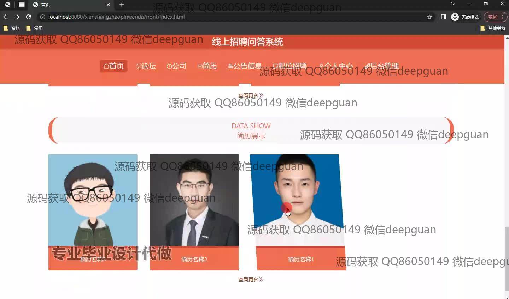
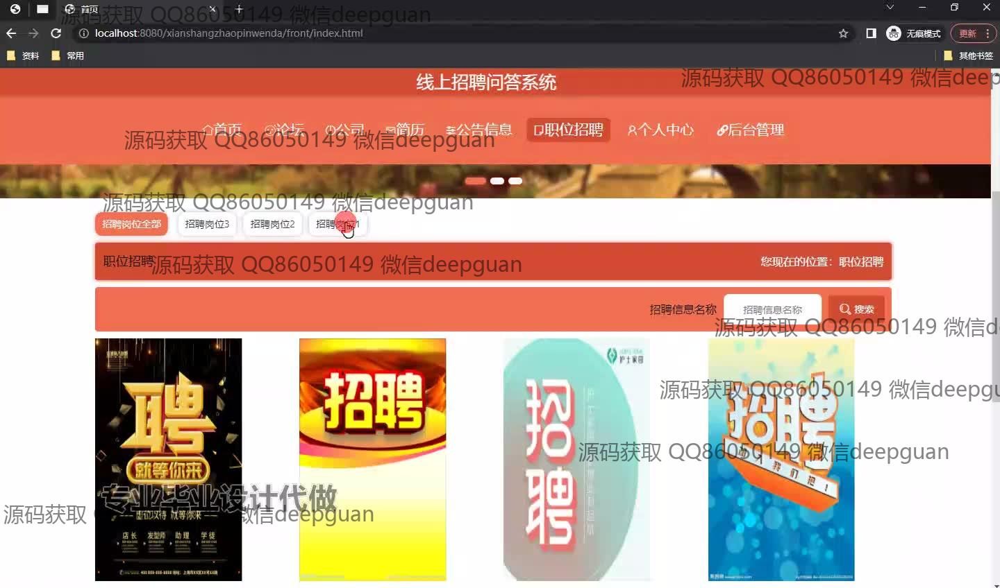
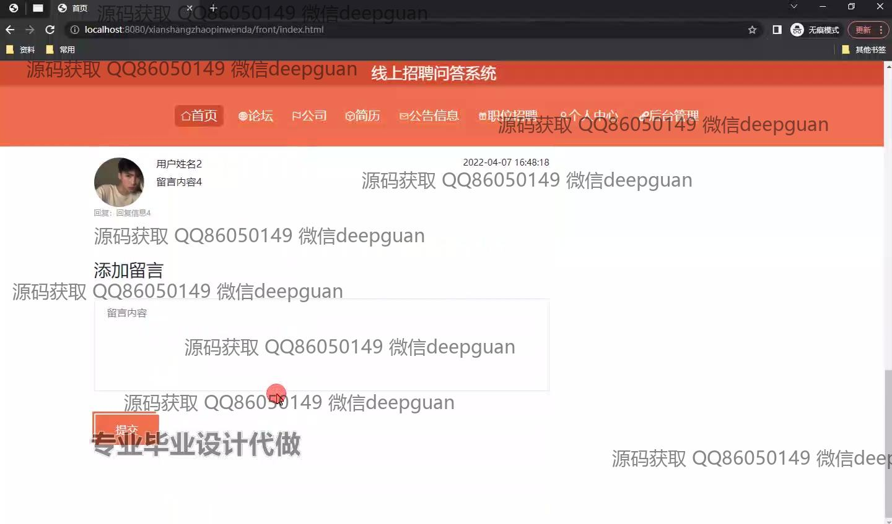
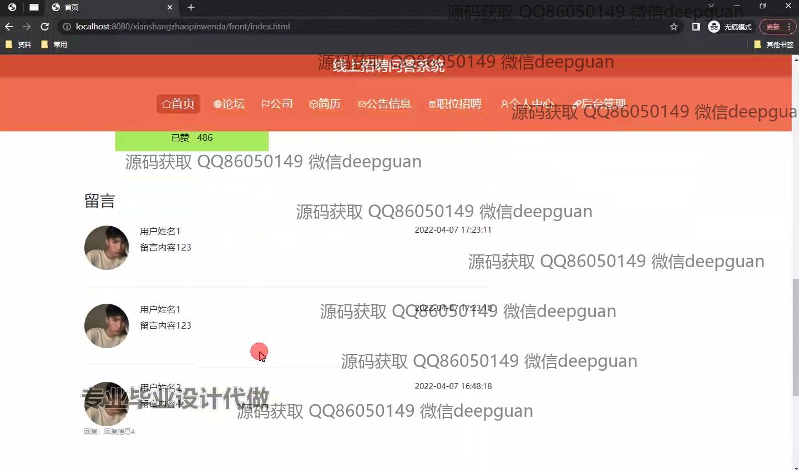
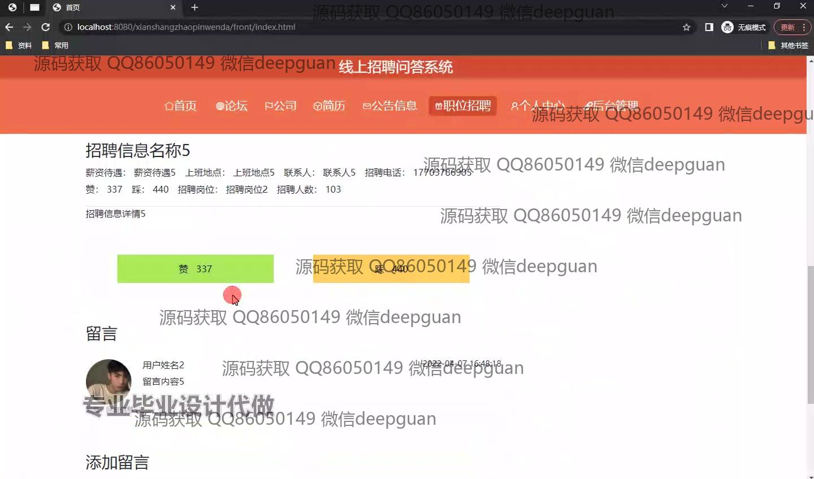
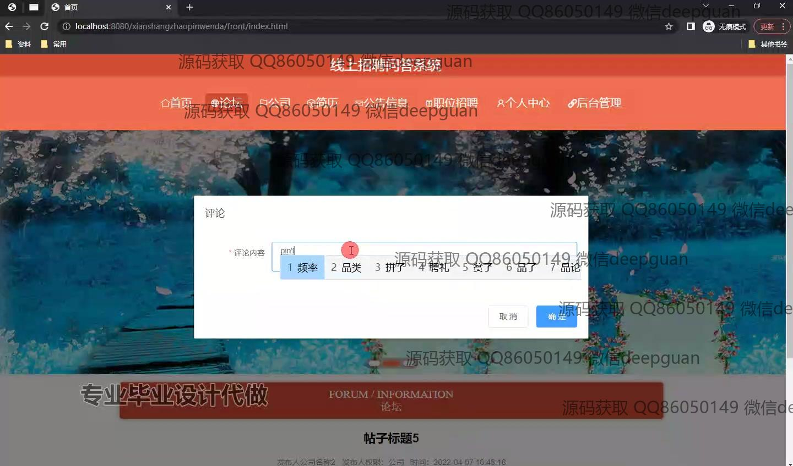
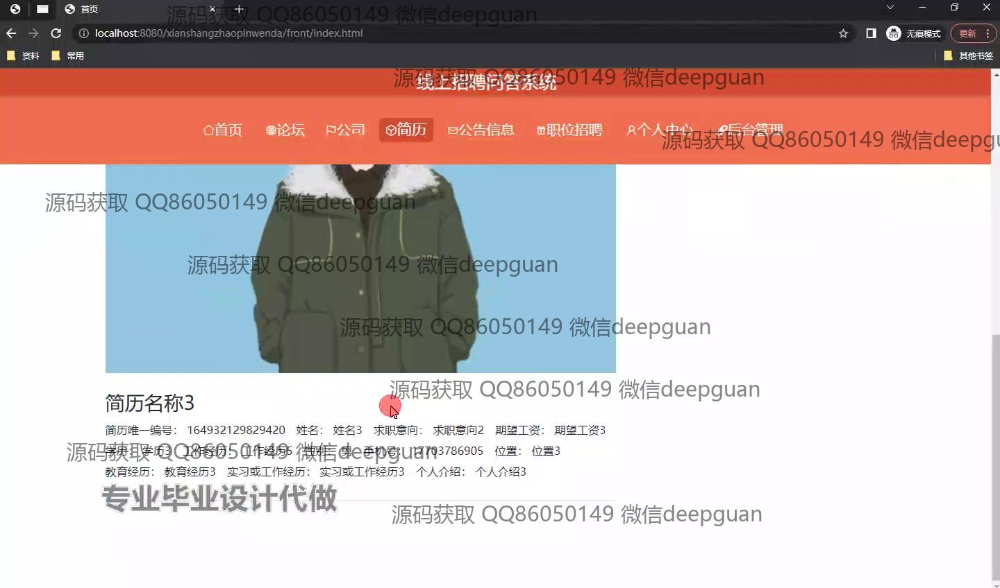
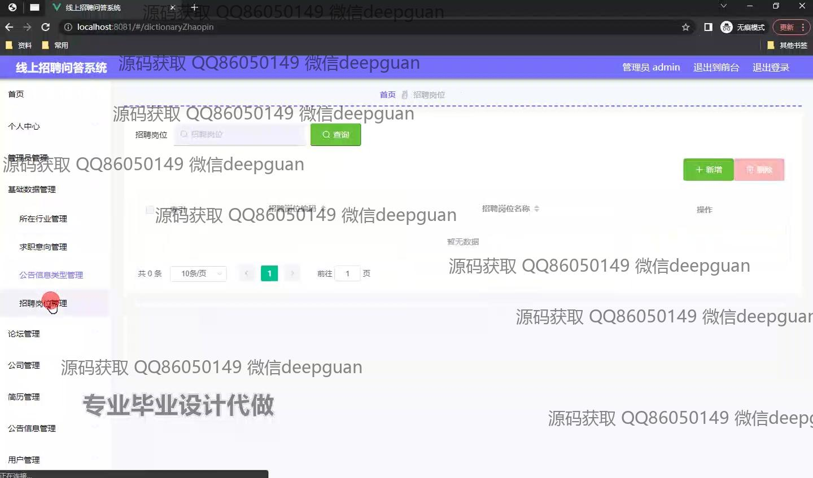
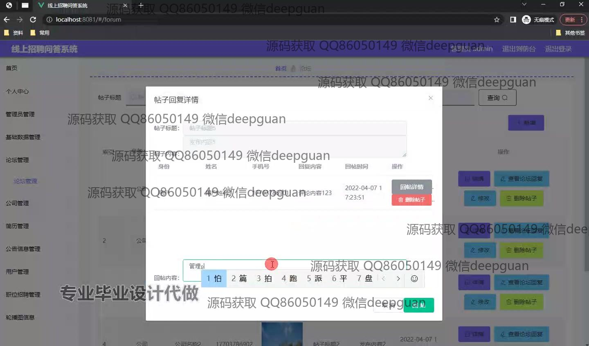
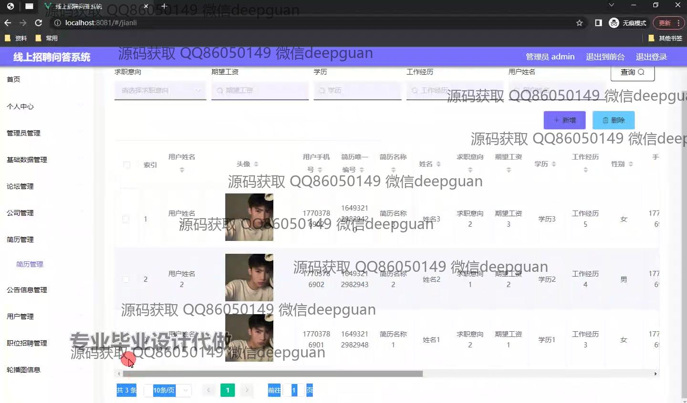
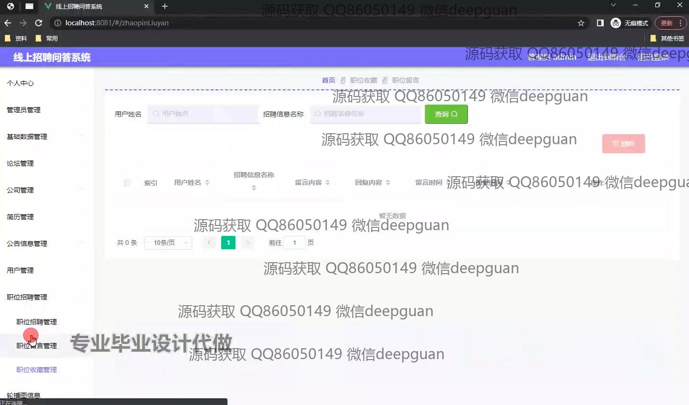
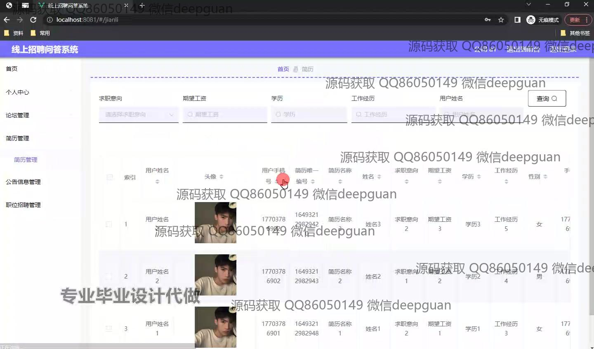
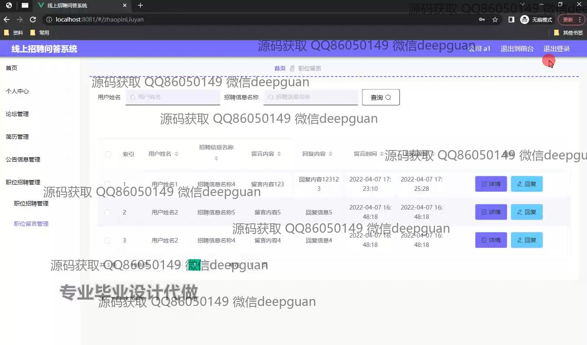
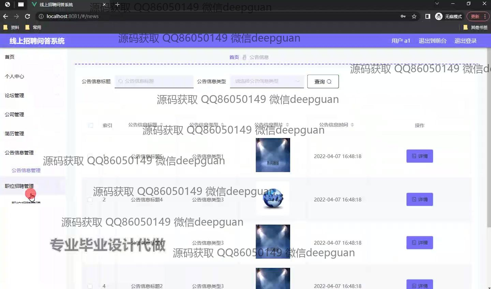

本代码来源于网络,仅供学习参考使用!

